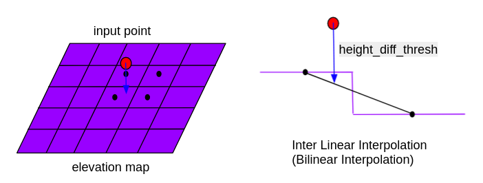

# compare_map_segmentation（比较地图分割）

## 目的

`compare_map_segmentation` 节点用于通过地图信息（如点云地图、高程地图或地图加载接口提供的分块地图）过滤输入点云中的地面点。

## 算法原理

### 高程地图对比滤波器（compare_elevation_map_filter_node.cpp）
通过比较输入点云与高程地图的Z轴值，计算相邻单元的高度差异。移除高度差低于`height_diff_thresh`阈值的点。

  

### 基于距离的对比滤波器（distance_based_compare_map_filter_nodelet.cpp）
使用kdtree的`nearestKSearch`函数将输入点云与地图点云进行最近邻搜索，移除与地图点云距离过近的点。支持静态加载或车辆运动时的动态加载。

### 基于体素的近似对比滤波器（voxel_based_approximate_compare_map_filter_nodelet.cpp）
创建地图点云的体素网格，通过`VoxelGrid`类的`getCentroidIndexAt`和`getGridCoordinates`函数检测输入点是否位于体素网格内，移除匹配的点。

### 体素化对比滤波器（voxel_based_compare_map_filter_nodelet.cpp）
对地图点云进行体素降采样，检查输入点周围是否存在降采样后的地图点。移除与体素网格邻近的点。

### 混合体素距离对比滤波器（voxel_distance_based_compare_map_filter_nodelet.cpp）
结合体素近似滤波器和距离滤波器：  
1. 用体素网格过滤位于网格内的点  
2. 对剩余点使用kdtree的`radiusSearch`二次过滤

---

## 输入/输出

### 高程地图滤波器

#### 输入
| 名称                    | 类型                            | 描述          |
| ----------------------- | ------------------------------- | ------------- |
| `~/input/points`        | `sensor_msgs::msg::PointCloud2` | 参考点云      |
| `~/input/elevation_map` | `grid_map::msg::GridMap`        | 高程地图      |

#### 输出
| 名称              | 类型                            | 描述          |
| ----------------- | ------------------------------- | ------------- |
| `~/output/points` | `sensor_msgs::msg::PointCloud2` | 过滤后的点云  |

#### 参数
| 名称                 | 类型    | 描述                                  | 默认值    |
| :------------------- | :------ | :------------------------------------ | :-------- |
| `map_layer_name`     | string  | 高程地图层名称                        | elevation |
| `map_frame`          | string  | 高程地图订阅前的临时坐标系           | map       |
| `height_diff_thresh` | float   | 高度差过滤阈值（米）                 | 0.15      |

### 其他滤波器

#### 输入
| 名称                            | 类型                            | 描述                     |
| ------------------------------- | ------------------------------- | ------------------------ |
| `~/input/points`                | `sensor_msgs::msg::PointCloud2` | 参考点云                 |
| `~/input/map`                   | `sensor_msgs::msg::PointCloud2` | 静态加载的地图点云       |
| `/localization/kinematic_state` | `nav_msgs::msg::Odometry`       | 动态加载时的车辆当前位姿 |

#### 输出
| 名称              | 类型                            | 描述          |
| ----------------- | ------------------------------- | ------------- |
| `~/output/points` | `sensor_msgs::msg::PointCloud2` | 过滤后的点云  |

#### 参数
| 名称                            | 类型    | 描述                                      | 默认值    |
| :------------------------------ | :------ | :---------------------------------------- | :-------- |
| `use_dynamic_map_loading`       | bool    | 地图加载模式（true=动态，false=静态）     | true      |
| `distance_threshold`            | float   | 点云对比距离阈值（米）                   | 0.5       |
| `map_update_distance_threshold` | float   | 触发地图更新的车辆移动距离阈值（米）      | 10.0      |
| `map_loader_radius`             | float   | 动态加载的地图半径（米）                 | 150.0     |
| `timer_interval_ms`             | int     | 地图更新检查定时器间隔（毫秒）           | 100       |
| `publish_debug_pcd`             | bool    | 启用调试点云发布（增加计算开销）         | false     |
| `downsize_ratio_z_axis`         | double  | Z轴体素尺寸缩小比例（正数）              | 0.5       |

---

## 已知限制
<!-- 实现中的假设条件与已知限制，例如：
- 依赖高精度先验地图
- 动态加载模式可能引入处理延迟 -->

---

## （可选）错误处理
<!-- 错误检测与恢复机制，例如：
- 当地图加载超时时触发异常处理
- 输入点云坐标系异常时的容错策略 -->

---

## （可选）性能指标
<!-- 算法复杂度与处理耗时分析，例如：
- 体素滤波时间复杂度：O(N)
- 10万点云处理耗时：15ms @ i7-11800H -->

---

## （可选）参考文献
<!-- 相关技术文档链接，例如：
[1] 《基于多传感器融合的SLAM技术》, 2022
[2] PCL库官方文档: https://pointclouds.org -->

---

## （可选）未来扩展
<!-- 计划实现的功能改进，例如：
- 支持多尺度地图融合
- 增加基于语义的分层过滤 -->