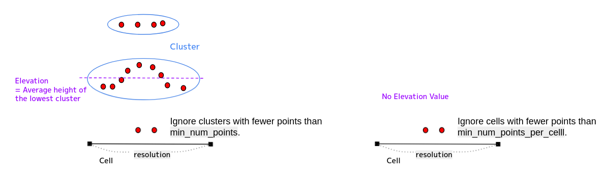

# elevation_map_loader

## 目的

本模块用于为`compare_map_segmentation`模块提供高程地图数据。

## 实现原理

### 高程地图生成流程
1. 通过订阅的点云地图（`pointcloud_map`）和矢量地图（`vector_map`）生成高程地图
2. 将生成的高程地图本地持久化存储，后续启动时可直接加载
3. 每个网格单元的高程值取最低点云簇的Z轴坐标平均值
4. 支持使用邻域值对空值单元进行插值修补

  

---

## 输入/输出

### 输入
| 名称                            | 类型                                            | 描述                  |
| ------------------------------- | ----------------------------------------------- | -------------------- |
| `input/pointcloud_map`          | `sensor_msgs::msg::PointCloud2`                 | 点云地图              |
| `input/vector_map`              | `autoware_auto_mapping_msgs::msg::HADMapBin`    | (可选) 车道级矢量地图 |
| `input/pointcloud_map_metadata` | `autoware_map_msgs::msg::PointCloudMapMetaData` | (可选) 点云地图元数据 |

### 输出
| 名称                         | 类型                            | 描述                  |
| ---------------------------- | ------------------------------- | -------------------- |
| `output/elevation_map`       | `grid_map_msgs::msg::GridMap`   | 高程地图              |
| `output/elevation_map_cloud` | `sensor_msgs::msg::PointCloud2` | (可选) 高程点云       |

### 服务
| 名称                           | 类型                                               | 描述                          |
| ------------------------------ | -------------------------------------------------- | ---------------------------- |
| `service/get_selected_pcd_map` | `autoware_map_msgs::srv::GetSelectedPointCloudMap` | (可选) 点云地图请求服务接口   |

---

## 参数配置

### 节点参数
| 参数名                          | 类型         | 描述                                                                 | 默认值       |
| :------------------------------ | :----------- | :------------------------------------------------------------------ | :---------- |
| map_layer_name                   | std::string  | 高程地图层级名称                                                    | elevation   |
| param_file_path                  | std::string  | GridMap参数配置文件路径                                            | path_default|
| elevation_map_directory          | std::string  | 高程地图存储目录                                                    | path_default|
| map_frame                        | std::string  | 地图坐标系                                                         | map         |
| use_inpaint                      | bool         | 是否启用空值插值                                                    | true        |
| inpaint_radius                   | float        | 插值邻域半径（米）                                                 | 0.3         |
| use_elevation_map_cloud_publisher| bool         | 是否发布高程点云                                                   | false       |
| use_lane_filter                  | bool         | 是否基于矢量地图过滤                                                | false       |
| lane_margin                      | float        | 车道多边形扩展边距（仅当use_lane_filter启用时有效）                | 0.0         |
| use_sequential_load              | bool         | 是否通过服务按需加载地图                                            | false       |
| sequential_map_load_num          | int          | 单次加载的点云地图分块数（需≤总块数）                              | 1           |

### GridMap参数
配置文件路径：`config/elevation_map_parameters.yaml`

#### 通用参数
| 参数名                                       | 类型  | 描述                                  | 默认值 |
| :------------------------------------------ | :---- | :----------------------------------- | :----- |
| pcl_grid_map_extraction/num_processing_threads | int  | 网格处理线程数                        | 12     |

#### 网格参数
| 参数名                                      | 类型  | 描述                                                                 | 默认值 |
| :----------------------------------------- | :---- | :------------------------------------------------------------------ | :----- |
| pcl_grid_map_extraction/grid_map/min_num_points_per_cell | int   | 网格单元最小点数（低于此值设为NaN）        | 3      |
| pcl_grid_map_extraction/grid_map/resolution| float | 网格分辨率（米）                                                   | 0.3    |
| pcl_grid_map_extraction/grid_map/height_type | int  | 高程计算模式： 0-最低簇均值 / 1-最大簇均值                      | 1      |
| pcl_grid_map_extraction/grid_map/height_thresh | float | 最大簇高度阈值（仅当height_type=1时有效）                        | 1.0    |

#### 点云预处理参数
| 参数名                                  | 类型  | 描述                         | 默认值 |
| :------------------------------------- | :---- | :-------------------------- | :----- |
| pcl_grid_map_extraction/cloud_transform/translation | float | 点云平移量（XYZ）            | 0.0    |
| pcl_grid_map_extraction/cloud_transform/rotation    | float | 点云旋转量（X-Y'-Z''坐标系） | 0.0    |

#### 聚类提取参数
| 参数名                                  | 类型  | 描述                         | 默认值 |
| :------------------------------------- | :---- | :-------------------------- | :----- |
| pcl_grid_map_extraction/cluster_extraction/cluster_tolerance | float | 聚类距离阈值（米）          | 0.2    |
| pcl_grid_map_extraction/cluster_extraction/min_num_points | int   | 最小聚类点数                 | 3      |
| pcl_grid_map_extraction/cluster_extraction/max_num_points | int   | 最大聚类点数                 | 1000000|

#### 离群值去除参数
| 参数名                                  | 类型  | 描述                         | 默认值 |
| :------------------------------------- | :---- | :-------------------------- | :----- |
| pcl_grid_map_extraction/outlier_removal/is_remove_outliers | bool | 是否去除离群值               | false  |
| pcl_grid_map_extraction/outlier_removal/mean_K             | int   | 邻域点数统计窗口             | 10     |
| pcl_grid_map_extraction/outlier_removal/stddev_threshold   | float | 标准差阈值                  | 1.0    |

#### 降采样参数
| 参数名                                  | 类型  | 描述                         | 默认值 |
| :------------------------------------- | :---- | :-------------------------- | :----- |
| pcl_grid_map_extraction/downsampling/is_downsample_cloud | bool  | 是否降采样                  | false  |
| pcl_grid_map_extraction/downsampling/voxel_size          | float | 体素尺寸（米）             | 0.02   |

---

## 技术参考
- PCL聚类算法文档：<https://pointclouds.org/documentation/tutorials/cluster_extraction.html>
- GridMap官方文档：<https://github.com/ANYbotics/grid_map/tree/ros2/grid_map_pcl>